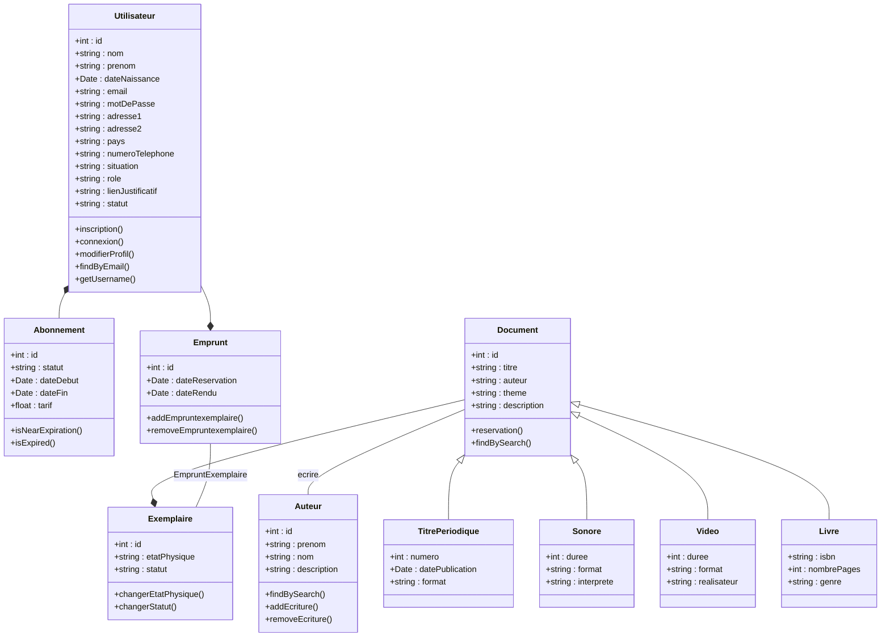

## 📌 Fonctionnalités à ajouter sur le site

### A finir : 
- Page 404 (page d'erreur)
- Ajout de document (a finir)
- Ajout de DateRendu (a finir)

### A faire (urgent) : 
- En cas de retard de rendu → envoi d’un mail ou message.
- Si l’abonnement arrive à échéance → envoi d’un mail ou message.
- Limite de 10 réservations simultanées par utilisateur.

### A faire (important) :
- Ajouter une date limite de retrait : passé ce délai, le livre est remis en rayon.
- Calcul des statistiques de retard.
- Système de pré-réservation ou liste d’attente pour un document déjà réservé.
- Si l’utilisateur se désabonne ou ne renouvelle pas → obligation de rendre les livres avant la fin de l’abonnement.
- Espace d’accueil spécifique pour le bureau des abonnés (ROLE_ADMIN).
- Ajout d’un filtre par thématique pour faciliter la recherche.
- Statut “approuvé” ou “refusé” pour les réductions ou certains profils client (optionnel si géré sur place).

---

## 📊 Données

### Matrice des données (en tableau) :

| Table              | Colonnes principales                                                                                  | Relations                                          |
|--------------------|-------------------------------------------------------------------------------------------------------|----------------------------------------------------|
| utilisateur         | id, nom, prenom, date_naissance, email, mot_de_passe, adresse1, adresse2, pays, numero_telephone, situation, role, lien_justificatif, statut | -          |
| employe             | id, utilisateur_id, poste, date_embauche                                                             | FK vers utilisateur.id                             |
| client              | id, utilisateur_id                                                                                   | FK vers utilisateur.id                             |
| abonnement          | id, statut, date_debut, date_fin, tarif, utilisateur_id                                              | FK vers utilisateur.id                             |
| document            | id, titre, auteur, theme, description, type                                                          | Hérite par livre, sonore, video, titre_periodique  |
| livre               | id, isbn, nombre_pages, genre, document_id                                                           | FK vers document.id                                |
| sonore              | id, duree, format, interprete, document_id                                                           | FK vers document.id                                |
| video               | id, duree, format, realisateur, document_id                                                          | FK vers document.id                                |
| titre_periodique    | id, numero, date_publication, format, document_id                                                    | FK vers document.id                                |
| exemplaire          | id, etat_physique, statut, document_id                                                               | FK vers document.id                                |
| auteur              | id, prenom, nom, description                                                                         | -                                                  |
| ecrire              | id, auteur_id, document_id                                                                           | FK vers auteur.id, document.id                     |
| article             | id, numero, titre_article, titre_periodique_id                                                       | FK vers titre_periodique.id                        |
| emprunt             | id, date_reservation, date_rendu, utilisateur_id                                                     | FK vers utilisateur.id                             |
| emprunt_exemplaire  | id, emprunt_id, exemplaire_id                                                                        | FK vers emprunt.id, exemplaire.id                  |

### Diagramme de Classes :

##### Légende : 
- `la flèche noire` : à une clé primaire de ..
- `la flèche blanche` :  à comme heritage ..
- `texte` sur une ligne : nom d'une table d'association 
- chaque attribut à un `getter` et un `setter`